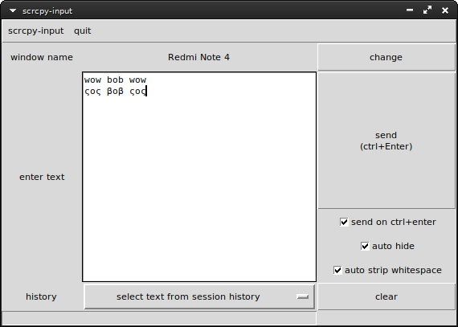
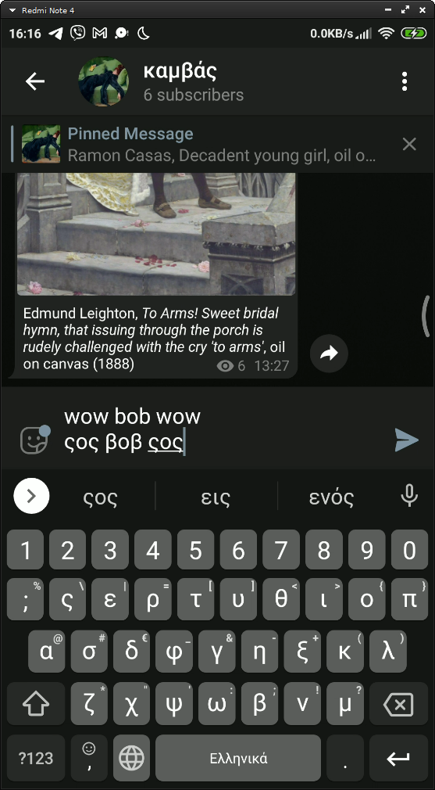

# `scrcpy-input.py`

[`scrcpy`](https://github.com/Genymobile/scrcpy) doesn't support non-ascii (unicode) key input. This tool copies your input to system clipboard and then synchronises it with android's clipboard and pastes it with Alt-v command. Obviously this will overwrite your clipboard contents. Make sure you focus on the text input on the scrcpy window before you attempt to paste.

<table align="center">
	<tbody>
		<tr>
			<td><kbd></kbd></td>
			<td><kbd></kbd></td>
		</tr>
	</tbody>
</table>
